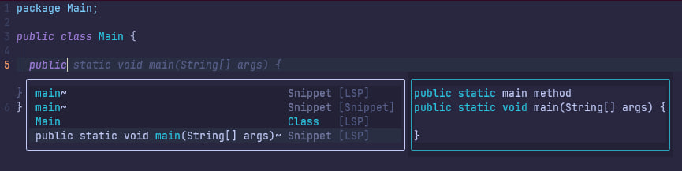

# Tutorial Intro

Let's discover **Fastvim in less than 5 minutes**.

## Getting Started

Welcome to Fastvim, the next-gen galactic ☄️ Neovim distro that’s fast, modern, and fully configurable. Built for both lazy people who don’t want to mess around with endless configurations, and for the martian 👽 Neovim hackers who want full control over their setup. Whether you just want things to work right out of the box or you love tweaking every little detail, Fastvim is here to help.

This distro has everything you need for a smooth and efficient workflow, and if you’re feeling adventurous, you can dive in and make it your own. With custom themes 🎨 made just for you, if you like having themes for every phase and mood you’re going through, just like me.

Get ready to experience a Neovim setup that just works, without all the hassle. Let’s get you set up, fast and easy!

### 📦 requirements 

- Neovim >= 0.9.0 (needs to be built with LuaJIT)
- Git >= 2.19.0 (for partial clones support)
- a Nerd Font(v3.0 or greater) (optional, but needed to display some icons)
- a C compiler for nvim-treesitter. See [here](https://github.com/nvim-treesitter/nvim-treesitter#requirements)
- pnpm for compile live server plugin (optional, but needed to load live server)
- build-essential needed to compile lua snip

## 💤 Installation

> Please, before installing, remember to make a backup of your dotfiles.

```
mv ~/.config/nvim ~/.config/nvim.bak
mv ~/.local/share/nvim ~/.local/share/nvim.bak 

# optional but recommended
mv ~/.local/state/nvim{,.bak}
mv ~/.cache/nvim{,.bak}
```

#### linux or mac

```bash
git clone https://github.com/fastvim/fastvim.git ~/.config/nvim 
cd .config/nvim
nvim # Then it will download everything by itself
```
#### Windows

```posh
git clone https://github.com/fastvim/fastvim.git $HOME\AppData\Local\nvim 
```

### 💻 Setup

For the distro to work as expected, we need to configure a few things, let's start by downloading the lsp(language server protocol) that you will use by installing with mason

To do this you type: `MasonInstall LspName`

Ex: 

```
:MasonInstall clangd
```
Or if you are java dev 

```
MasonInstall jdtls
```

Lsp (language server protocol) bring you countless benefits when coding, such as auto completions, syntactic error warnings in real time, and for this we have some plugins like [blink-cmp](https://github.com/Saghen/blink.cmp), for snippets we have [ luasnip](https://github.com/L3MON4D3/LuaSnip) that works exceptionally well and we have mini.pairs to autocomplete special characters like [], (), etc...



With the setup complete, you're now ready to dive into using your new Neovim IDE. Let's get started!

### Quickstart

Now that everything is set up, let's jump into using FastVim. Follow these steps to start coding efficiently:

Open Neovim
Launch Neovim by running:

```bash
nvim
```
Explore the Dashboard
Upon starting Neovim, you'll see a customizable dashboard. Use it to quickly open recent files, create new projects, or access settings.

Install Plugins
Ensure all required plugins are installed by running:

```bash
:Lazy
```
This will display the plugin manager. Press u to update all plugins.

Set Up LSP
If you haven't installed your language server yet, use Mason:

```bash
:MasonInstall LspName
```
Replace LspName with the appropriate server for your language (e.g., clangd for C/C++, jdtls for Java).

Start Coding
Open a file or create a new one:

```bash
nvim myfile.extension
```
Replace extension with the file type you're working with (e.g., java, go, sql). Autocompletions, syntax highlighting, and LSP features will be ready to assist you.

**update distro**

To update the distro you have two options, `:FastUpdate` which will update the distro to the latest version, and `:FastStable` which will update the distro to the latest stable version (recommended)

**Explore Keymaps**
This configuration comes with pre-mapped keys for common actions. Check the keybindings guide by pressing:

```bash
:help keymaps
```